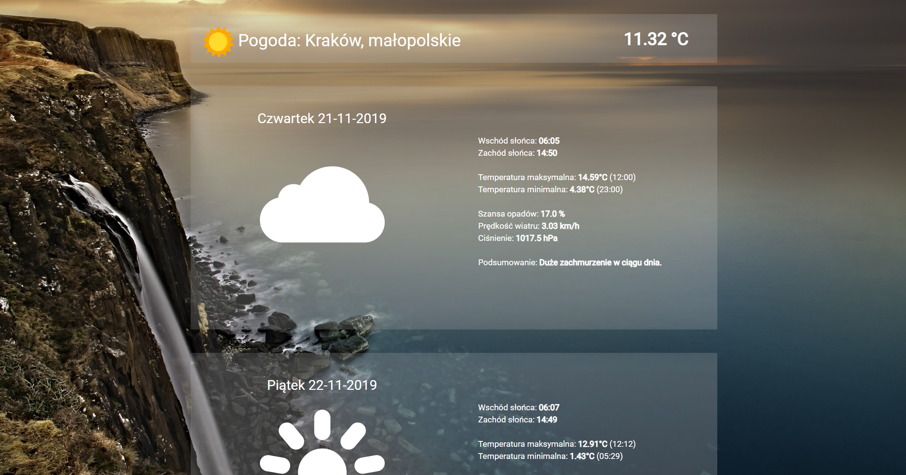

# WeatherApp 

 
 
 

<b>What is WeatherApp?</b>

<b>WeatherApp</b> is a <b><i>Spring Boot</i></b> client for Dark Sky Api. The application allows you to check the weather forecast for the next week. <a href="https://github.com/dvdme/forecastio-lib-java">Java Wrapper Library</a> was used to communicate with Dark Sky Api. 

 

<b>Template engine, styles and pictures</b>

WeatherApp uses <b><i>Thymeleaf</b></i> to manage templates. All icons were downloaded from <a href="https://www.flaticon.com/home">flaticon</a>. Bootstrap and my own css styles were used to style WeatherApp. Below you can see a screenshot showing the appearance of the application: 

 

